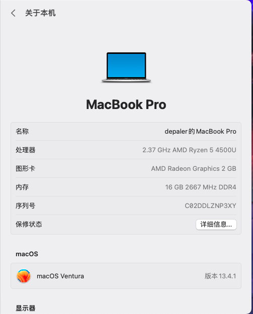

# RedmiBook-14-II-AMD-hackintosh

## Based on OpenCore-0.9.3-RELEASE
## Please use the GenSMBIOS or other tools to change the SMBIOS
## When you are installing Macos,disable NootedRed
## If your code gets stuck with the words include "vnode" ,please Plug or unplug USB

## Macos supportability
- ✅ macOS Ventura 13.4
- ……Waiting for you to test

## hardware configuration

Type | Spec | supportability
:---------|:---------|:---------
Model Name | RedmiBook 14 II AMD | ✅
CPU | AMD Ryzen™ 5 4500U | ✅
RAM | Samsung 16 GB 2667 MHz DDR4 | ✅
Wi-Fi | Realtek 8822CE | ❌
Bluetooth | Realtek 8822CE | ❌
Audio | Realtek ALC256 | ✅
SSD | Samsung PM881 | ✅
KeyBoard | PS2 controller | ✅
TouchPad | ELAN230A |✅
USB | disable XCHI0/1 | ✅

## Problem

### USB
Use the UMAF to disable XCHI controler
https://github.com/DavidS95/Smokeless_UMAF

XCHI controler | USB port
:---------|:---------
xchi0 | left usb3.0 , lower side Type-C and Bluetooth(?)
xchi1 | right usb2.0 and upper side Type-C(Still able to charge)

### Network
- replace supported network card
- using USB network sharing on mobile phones
### sleep
## Credits

- [Apple](https://www.apple.com) for macOS.
- [Acidanthera](https://github.com/acidanthera) for OpenCore and most Kexts.
- [NootInc](https://github.com/NootInc) for all the hard work to support AMD iGPU and trackpad.
- [ExtremeXT](https://github.com/ExtremeXT) for the instruction to disable XHC1
- And anyone else that helped to develop and improve hackintoshing.

